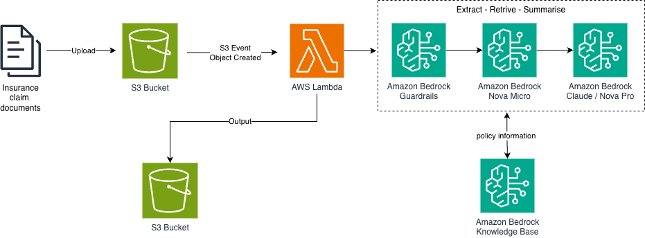

# Insurance Claims Processing (PoC)

## Overview

This repository contains a Proof-of-Concept (PoC) for an AI-powered insurance claims processing pipeline built on AWS.
This project uses agent-driven development to keep implementation iterative, focused, and easy to parallelize.

The system processes unstructured claim documents and transforms them into structured, actionable outputs by combining:

- LLM-based information extraction
- Automated claim summarization
- Optional enrichment using policy knowledge (RAG)

The architecture emphasizes:

- Clear separation between data storage, processing logic, and AI inference
- Reusable components (prompt management, model invocation, validation)
- Lightweight model evaluation (latency, output quality, consistency)

This PoC demonstrates how foundation models can be integrated into enterprise workflows for intelligent document processing (IDP) to reduce manual effort and improve consistency.

---

## Demo Flow

The smallest end-to-end flow demonstrated by this PoC:

1. Upload a claim document to Amazon S3
2. Trigger an AWS Lambda function
3. Process the document using Amazon Bedrock
4. Extract structured claim data
5. Generate a concise claim summary
6. Save results back to Amazon S3

Additional capabilities (policy enrichment, validation, evaluation, UI) are added incrementally.

---

## PoC Constraints

- Focus on a single document type (for consistency)
- Minimal infrastructure and configuration
- No production-level hardening
- Prioritize clarity and end-to-end flow over completeness

---

## Capabilities (Incremental)

As the PoC evolves, it may include:

- Retrieval-Augmented Generation (RAG) using policy knowledge
- Basic PII handling and guardrails
- Simple validation of extracted data
- Lightweight model comparison (latency, quality, cost)
- Minimal UI for demo visualization

---

## Architecture Approach

The system is designed around a simple, modular pipeline:

- **Ingestion layer** → document upload and storage (S3)
- **Processing layer** → event-driven compute (Lambda)
- **AI layer** → model inference via Amazon Bedrock
- **Output layer** → structured results and summaries

Each layer is loosely coupled to allow iterative improvements without large refactoring.



---

## Documentation

This repository keeps documentation intentionally small so humans and agents can move quickly.

- [AGENTS.md](AGENTS.md): agent working rules and doc map
- [docs/plan.md](docs/plan.md): execution plan, phases, and workstreams
- [docs/spec.md](docs/spec.md): PoC scope, inputs, outputs, and done criteria
- [docs/tasks.md](docs/tasks.md): active task list (current iteration only)
- [docs/log.md](docs/log.md): task execution log (decisions, outcomes, blockers)

## Repository Structure

- `infra/cdk/`: CDK app and stack definitions
- `scripts/`: small CLI helpers for the demo workflow
- `src/handlers/`: Lambda handler entrypoints
- `src/lib/`: shared Python helpers
- `prompts/`: prompt assets
- `data/events/`: sample event payloads for local handler runs
- `data/input/`: sample input documents
- `data/output/`: sample outputs
- `data/input/claim-001.pdf`: current sample claim document for local development

---

## Local Python Setup

This PoC uses Python `3.12` with `venv` and `pip`.

Create and activate a virtual environment:

```bash
python3 -m venv .venv
source .venv/bin/activate
```

Install project dependencies:

```bash
pip install -r infra/cdk/requirements.txt
```

That installs both the CDK libraries and `boto3` for the local upload and Bedrock-enabled CLI flows.

---

## Running Python Files

Run a Python file from the repository root:

```bash
python path/to/file.py
```

Examples:

```bash
python infra/cdk/app.py
python -m src.handlers.claims_processor
python -m src.handlers.claims_processor --event path/to/event.json
```

For the CDK app specifically, run commands from `infra/cdk/`:

```bash
cd infra/cdk
python app.py
```

For local Lambda handler testing, run from the repository root:

```bash
python -m src.handlers.claims_processor
```

That command uses local input and output folders by default. To test with the checked-in sample event payload:

```bash
python -m src.handlers.claims_processor --event data/events/s3-put-claim-001.json
```

To test with your own event payload:

```bash
python -m src.handlers.claims_processor --event path/to/event.json
```

If you want the local run to call Amazon Bedrock instead of the regex-based local fallback, set `BEDROCK_MODEL_ID` and ensure AWS credentials are available before running the command.

## Demo Upload

Use the helper script below to upload the sample PDF to the deployed S3 input bucket:

```bash
python scripts/upload_claim.py --bucket <claims-input-bucket-name>
```

Optional arguments:

- `--file` to upload a different PDF
- `--key` to change the S3 object key
- `--region` to override the S3 client region

The CDK stack outputs the generated input and output bucket names after deployment.
